Smoking and Vaping Trends in the United States
================
David Barranquero

## Introduction

This project explores the prevalence of smoking in the United States and
the emerging vaping trends among youth. These trends are of great
importance to health researchers, medical professionals and governments
as they are a key component in understanding the overall health of a
population. We aim to understand where the United States sits globally
in terms of smoking trends, understand what patterns have emerged in the
past few decades, and moreover where is the US likely heading with
smoking and vaping trends among its youth.

## Questions/Aims

The first question to be asked is what are the global trends in
cigarette smoking rates? This question aims to establish the wider
picture of overall trends in recent years, and reveal the US’s place in
the wider trends.

Next we wish to again look at the United States as a whole and ask what
have been the trends in smoking rates in the United States from 1995 to
2010? We want to facet by geographic region in the Northeast, Midwest,
South and West, and also by smoking frequency, exploring daily smokers,
weekly smokers, former smokers, and non-smokers?

Furthermore, we wish to look specifically at the years from 2005 to 2009
and determine what are the largest costs to the state associated with
cigarette smoking. Regarding trends in sex, we want to explore the
percentage of male deaths from smoking in this time period is the same
with that of females, when averaged among the states. We also wish to
explore if there is a correlation between the overall cost to a state,
and the number of individuals dying from smoking related illnesses.

Finally, we wish to look at the trends in vaping and e-cigarette usage
among youth from 2011-2020 and see if we can predict their smoker status
based on their age, sex, vaping status and frequency.

## Results

### Section A: Global Smoking Trends

While this report examines the trends and patterns in smoking rates and
cigarette use through the lens of the United States, it is important to
consider the patterns in the United States in a macroscopic form, as
part of a wider context of trends and patterns around the globe.

We begin first by examining the global trends in the data using
non-parametric regression.

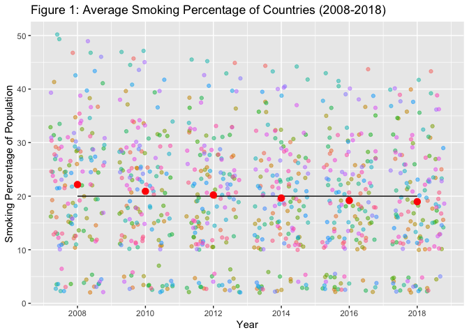<!-- -->

Figure 1 presents the mean smoking percentage for 149 countries from
2008 to 2018. We can see there is an overall downward trend to the mean
smoking percentage in this time, averaging 22.16% in 2008, and 18.97% by
2018. Most countries tend to be centered around the 10%-30% smoking
population range, with clusters around the 0-5% and a scattering of
outliers above 30%.

Furthermore we can examine the top ten countries by smoking rates per
year, and the United States in relation to these countries for both 2008
and 2018.

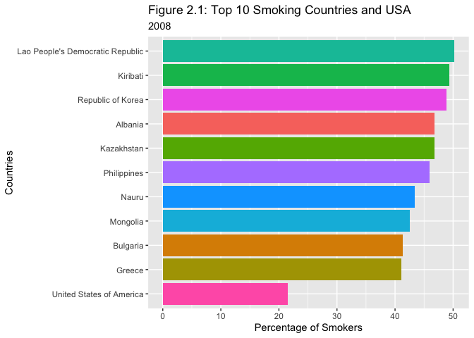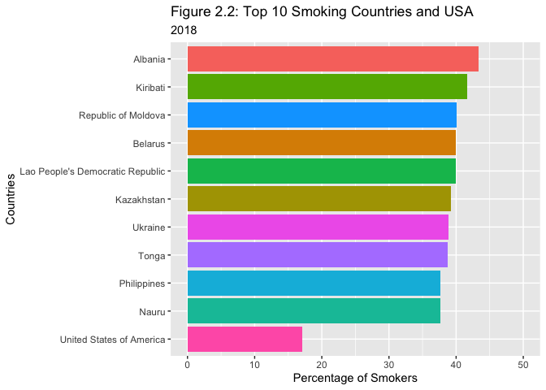

We observe from Figures 2.1 and 2.2 that even among the heaviest of
smokers, there has been a downward trend in smoking habits for these
nations in the decade from 2008 to 2018. Furthermore we observe that the
US’s smoking percentage is less than half of that of the largest smoking
nation for 2008, Laos, and approaching a third of the smoking rate of
the heaviest smoker in 2018, Albania. What can be concluded from this is
that despite the massive consumption of cigarettes in the US throughout
the 20th century, in the 21st century, after numerous revelations on the
long terms adverse effects of smoking, the United States is no longer a
smoking nation relative to the rest of the world. According to this
World Health Organisation data set, in 2008 they ranked 84th in terms of
smoking percentage of population, and 79th in 2018.

If we examine the overall smoking trend in the US from this data set, we
can clearly see a strong decline in smoking percentages, even within the
last decade.

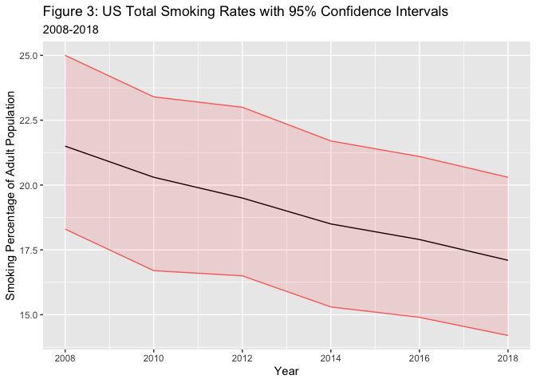

In 2008, approximately 21.5% of US citizens were smokers, with a 95%
confidence interval of \[18.3, 25.0\]. In 2018, this had decreased to
17.1%, with a 95% confidence interval of \[14.2, 20.3\]. This represents
a relative percentage decrease of just over 20% in a decade. However, it
should be noted that an increase from 18.3 to 20.3 from 2008 to 2018
would fit within the confidence intervals, so we should be wary from
making too strong an assertion from this data alone. From here, we will
examine smoking trends in the United States from 1995 to 2010, and
explore the impacts of long term mass consumption of cigarettes and
tobacco on the nation.

### Section B: US Smoking Trends

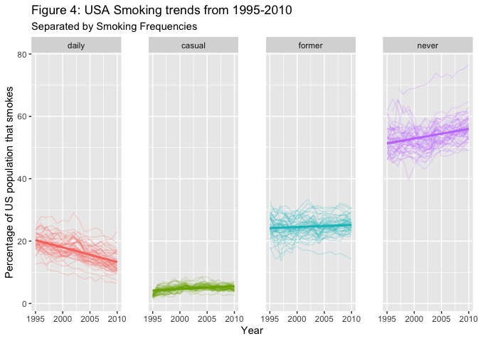<!-- -->

If we examine Figure 4 above, we can see that there has been change in
smoking frequencies in the United States from 1995 to 2010. The most
notable difference is the decline in daily smokers over this time period
from approximately 20% of the United States population to approximately
13%. Furthermore, the rate of non-smokers in this time period has also
seen an increase from about 52% to 57%. The proportions of casual
smokers has remained relatively constant in increasing only from 3% to
5% from 1995 to 2010. Finally, the proportions of former smokers has
remained steady at 25% throughout this period. As the rate of former
smokers has remained relatively constant in this time period, but the
rate of daily smokers has decreased and the rate of non-smokers has
increased, we can deduce that the change in trends is not daily smokers
quitting, but more likely a new generation not beginning smoking in the
first place. Furthermore, the decrease in daily smokers most likely a
result of individuals passing away from health complications caused from
long-term cigarette consumption. We observe that for all smoking
frequencies except casual, there is notable variation in the smoking
trends of US states from 1995 to 2010. There may be regional influences
in the data that may explain the nature of this variation. If we facet
on the four major geographical regions of the United States, West,
Midwest, Northeast and South, we observe that there is geographic
variation in the different smoking trends.

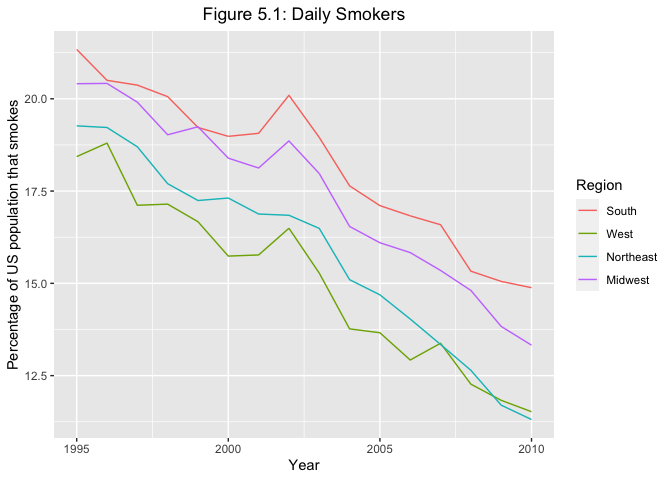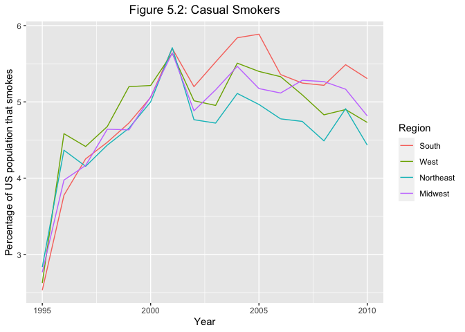

Observing the trends among regions, there is a consistent nature to the
decline in the proportion of daily smokers, and although there’s
frequent interweaving, the proportion of casual smokers among the
different regions are all fairly similar. There is an interesting change
in the trends in casual smoking from a consistent increase from 1995 to
2001 to leveling out from 2001 to 2010. The proportion of daily smokers
also experiences a sharp uptick in 2001 for all regions before again
continuing its downward trend from 2003 onward. Given the evolving
geo-political tensions at the time with the 9/11 terrorist attacks, it
would be unsurprising if these trends were from a direct result of the
events of 9/11, with many Americans turning to smoking to deal with the
stress of the time.

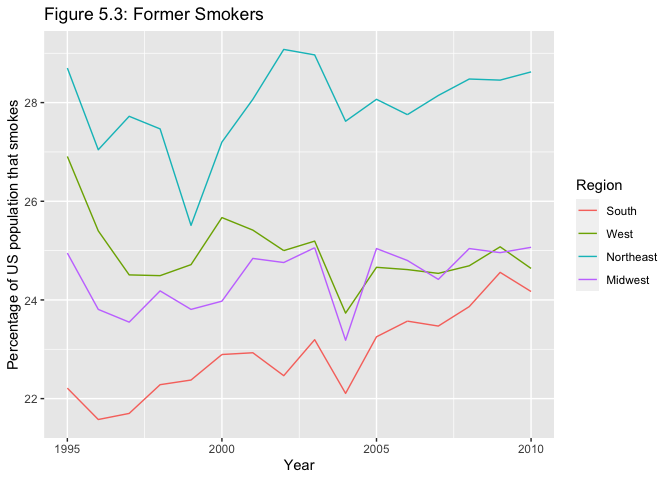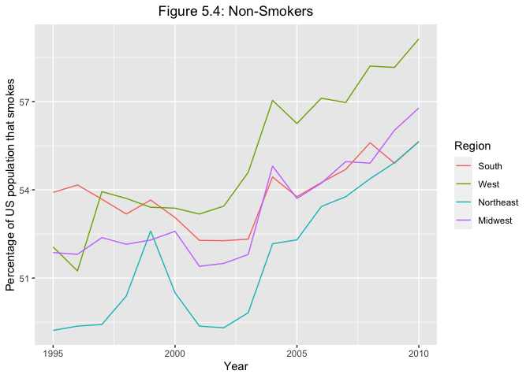

The differences in trends for former smokers are quite pronounced with
the West experiencing a decrease in former smokers from 1995 to 2010,
while the South, West and Midwest all experienced an increase.
Furthermore there is a large difference in the population percentage of
former smokers among regions with the former smoker population
percentage of the South being roughly 6% less than that of the
Northeast. With regards to non-smokers, all states are experiencing an
increase of non-smokers in their population. While the increases in the
Northeast, West and Midwest are roughly similar, the South has
experienced a far more gradual increase.

In comparing regions, the South exceeds the other regions in smoking
consumption, having the largest population percentages in daily and
casual smoking in 2010, and the lowest percentages in former and
non-smokers. The reason for this is likely historical with the
intertwined nature of Southern economic prosperity and tobacco
cultivation.

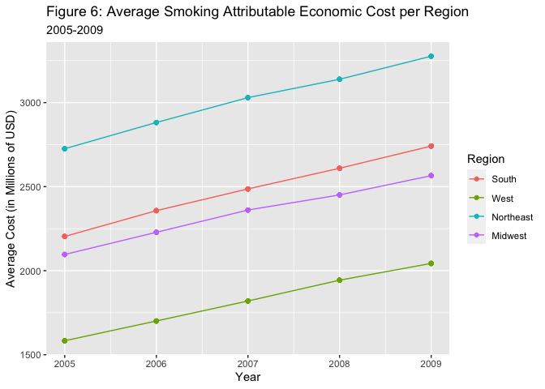

Furthermore, the costs of smoking, both financial and in human life, are
a major component of the impact of mass cigarette consumption in the
United States. If we examine first the financial costs to the United
States we can see, from Figure 6, there is a clear consistent increase
in economic burden being imposed by smoking in the United States. Across
all regions, the trends in economic costs that are attributable to
smoking are increasing every year, with the lines of growth appearing
parallel. Furthermore, we can break down where exactly these expenses
are being generated from.

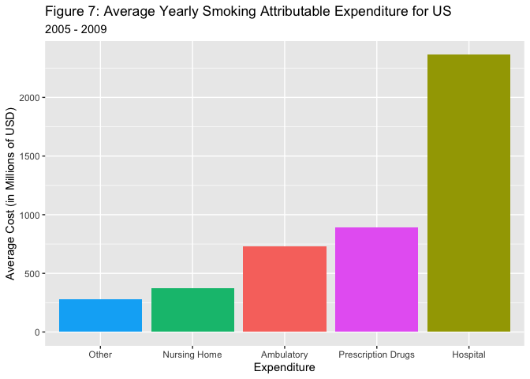

From Figure 7, the Smoking Attributable Economic costs take the form of
hospitalization, prescription drugs, ambulatory costs, nursing home
requirements and more, averaging a total of \$4.636 billion USD
annually. As is clearly displayed, the cost of hospitalization of
individuals with smoking attributable illnesses is by far the largest
economic cost attributable to smoking, accounting for a national average
of \$2.364 billion USD annually from 2005-2009 and costs the United
States more than the other expenditures combined. Furthermore, if we
examine the human cost, there is a large loss of life attributable to
smoking related illnesses.

|   Sex   | Smoking Deaths | Total Deaths | Proportion |
|:-------:|:--------------:|:------------:|:----------:|
| Female  |      3718      |    13025     |    0.29    |
|  Male   |      4943      |    13259     |    0.37    |
| Overall |      8660      |    26285     |    0.33    |

State Average Yearly Smoking Deaths for US (2005-2009)

In comparing the differences between men and women, we can see that
males are accounting for a larger proportion of smoking deaths than
women, averaging 37% of all deaths from 2005 to 2009. Female smoking
deaths accounted for 29% of all deaths in the same period. The most
pressing statistic however is that overall, 32% or approximately one
third of all deaths that occurred in the United States from 2005-2009
were directly attributable to smoking.

Furthermore, if we plot the average number of smoking deaths from
2005-2009 and then average statewide cost in this time, we can see there
is a strong positive linear relationship between the two variables. This
linear relationship is even clearer with a log transformation of the two
variables.

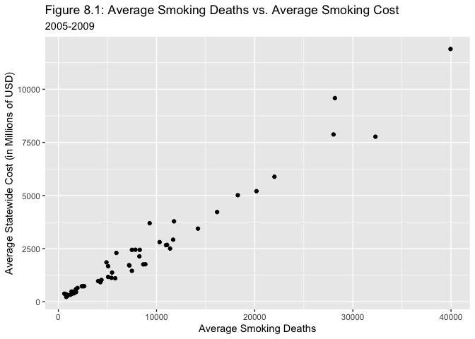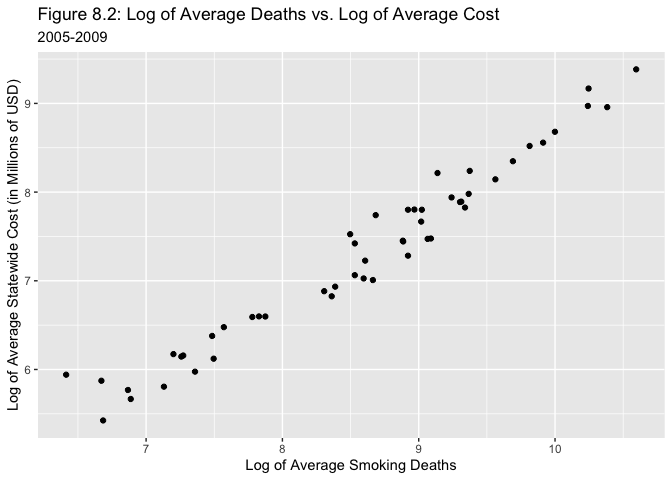

As such, we will consider a log-log model for this data. We partition
our data into a training set and test set, with forty states for
training and eleven for testing.

Our model is

 = \log(Deaths)")

    ## 
    ## Call:
    ## lm(formula = log(avg_cost) ~ log(deaths), data = training_data)
    ## 
    ## Residuals:
    ##      Min       1Q   Median       3Q      Max 
    ## -0.37885 -0.17288 -0.01514  0.10553  0.62291 
    ## 
    ## Coefficients:
    ##             Estimate Std. Error t value Pr(>|t|)    
    ## (Intercept)  -0.5787     0.2883  -2.008   0.0518 .  
    ## log(deaths)   0.9194     0.0334  27.526   <2e-16 ***
    ## ---
    ## Signif. codes:  0 '***' 0.001 '**' 0.01 '*' 0.05 '.' 0.1 ' ' 1
    ## 
    ## Residual standard error: 0.2238 on 38 degrees of freedom
    ## Multiple R-squared:  0.9522, Adjusted R-squared:  0.951 
    ## F-statistic: 757.7 on 1 and 38 DF,  p-value: < 2.2e-16

If we fit our log-log model on the training data set, firstly, the
estimate
^T"),
and hence the equation for the fitted model is
 = -0.5787 + 0.9194 \times log(DEATHS)").

In looking at model fit, we have a residual standard error of

0.2238 on 38 degrees of freedom, which is very small. The

value is 0.9522, indicating that 95.22% of the variation in the response

can be explained by our predictors
,
Finally, the

is 0.951, which is close to the

value and indicates a good fit to the data.

Looking at out F and t statistics, the

statistic is 757.7 on 1 and 38 degrees of freedom, resulting in a
p-value of less than 2.2e-16, we can thus conclude at

significance level that at least one of our regressor coefficients is
important to the model. As we only have one predictor, this means that
our predictor is significant to the model.

The same conclusion can be reached by observing our t-values. The

value for

was 27.526, which gives a p-value of less than 2e-16. If we were to
conduct the hypothesis test that
,
as the p-value is less than

we would conclude that there is sufficient evidence to reject the null
hypotheses that

at the 5% level of significance.

There were numerous models that were trialed in the selection process
for the linear model, however the chosen model was only that satisfied
all Ordinary Least Squares assumptions.

- ![\mathbb E\[\textbf{e}\] = 0](https://latex.codecogs.com/png.image?%5Cdpi%7B110%7D&space;%5Cbg_white&space;%5Cmathbb%20E%5B%5Ctextbf%7Be%7D%5D%20%3D%200 "\mathbb E[\textbf{e}] = 0")
- ![\mathbb V\[\textbf{e}\] = \sigma^2\bf I](https://latex.codecogs.com/png.image?%5Cdpi%7B110%7D&space;%5Cbg_white&space;%5Cmathbb%20V%5B%5Ctextbf%7Be%7D%5D%20%3D%20%5Csigma%5E2%5Cbf%20I "\mathbb V[\textbf{e}] = \sigma^2\bf I")
- ")

Plotting the residuals vs fitted values to test for a linear
relationship and constant variance. We can plot histograms of the
residuals to confirm they are normal, with mean 0 and constant variance.

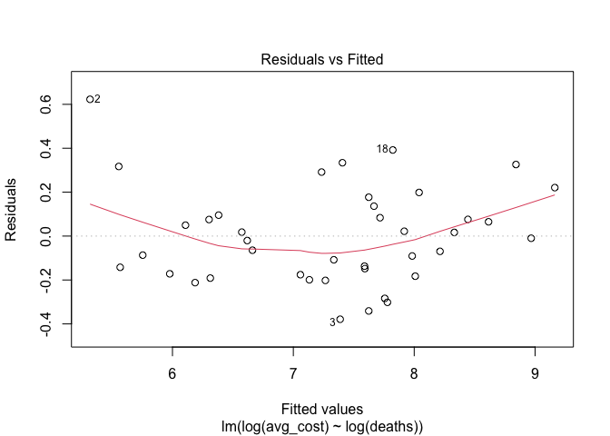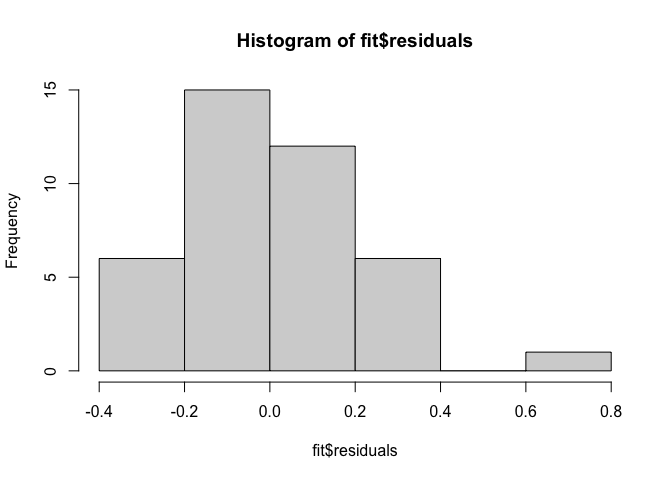

There’s no clear fanning or patterns to the plot, and so the assumption
of homoscedasticity is satisfied. Furthermore the relationship is
approximately linear, and so our assumption of mean 0 is satisfied.

There is some evidence of right skew to the histogram, the values are
however centered around 0.

If we perform a Shapiro-Wilk test to see if the residuals are normally
distributed, we obtain,

    ## 
    ##  Shapiro-Wilk normality test
    ## 
    ## data:  fit$residuals
    ## W = 0.96678, p-value = 0.2833

The test returns a p-value \>

so there is insufficient evidence to reject that the residuals are
normally distributed with mean 0 and constant variance.

Lastly, we will assess the predictive ability of our model, with the
Mean Squared Error (MSE) loss function.

    ## [1] "Log-Log Model MSE: 126285.47"

Our model in the linear space is defined as

which, when converted to the log-transformed space, becomes

 = \beta_0 + \beta_1\log(\textbf{X}).")

A log-transformation is required however in order for the model to fit
the data well and still satisfy all OLS assumptions. There may however
be an alternative method that may have a stronger predictive ability
than the log-log model.

We will consider if we can get a better predictive result using
K-nearest neighbours (KNN). We will perform leave-one-out cross
validation (LOOCV), but for every potential value of k from 1 to 39 for
our data of 40 observations, to find the optimal K to compete against
the MSE of the log-log model.

After performing the leave-one-out cross validation for all 39 K’s we
determine the optimal K is,

    ## [1] "K = 4"

Thus, K = 4, minimizes the Mean Square Error of the prediction. the
performance the KNN model waivers with larger values given the increases
separation between points. We can see this by plotting the different
MSE’s for different K’s we can see the performance deteriorating as K
increases. This is to be expected, given the large orders of magnitude
on the original scale, with more values being used skewing the
predictive result.

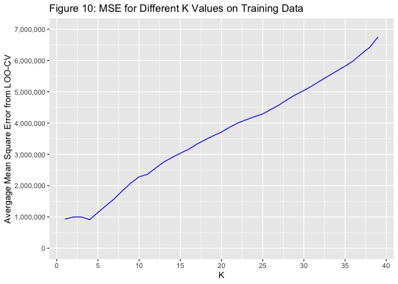

Finally, we will use the test data of 11 observations to determine which
method performs best on unseen data. The results of this trial were,

    ## [1] "KNN MSE on optimal K: 128185.67"

We can see, with a MSE of 126285.47, that the log-log model, performed
better than the KNN on the optimal K=4, with a MSE of 128185.67. If we
plot the two models, using the entire data set, we can see that both
models to have a strong fit to the data. The log-log model has far less
variation in that it fit’s a straight line to the model, in comparison
with the KNN model, which mas more variation to fit to individual data
points. It is unsurprising that the parametric model has performed best,
as the data in the log-transformed space is highly linear, and so
imposing a linear form on the data is valid, and yielded better
predictive performance.

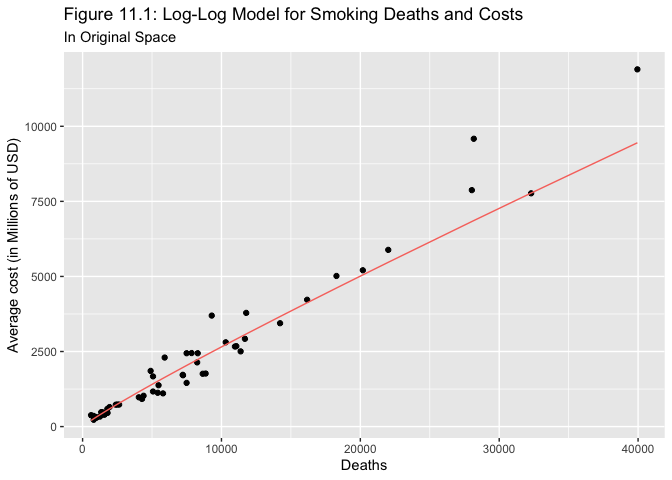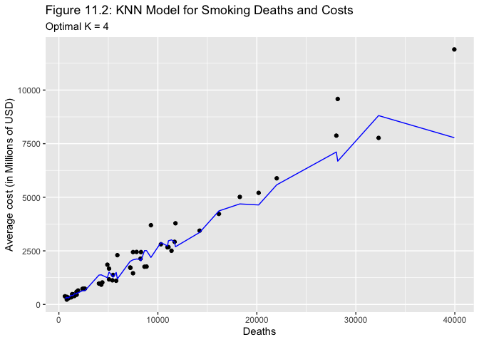

### Section C: US Vaping Trends

From what we have seen so far, the number of individuals in the United
States, by and large is decreasing. While the number of daily smokers
was decreasing and the number of non-smokers is increasing, the long
term costs of mass cigarette consumption are now being felt, with the
high number of deaths being observed, and the massive economic burden it
places on state health care systems. It is important now to answer the
question, where are we going? While cigarette smoking (henceforth called
smoking) is decreasing, the consumption of e-cigarettes and vapes is
reported to have grown significantly, especially among youth. We will
explore the results of the National Youth Tobacco Survey, to understand
the overall trends in smoking and vaping among youth. The scope of our
data will encompass from 2011 - 2020 and include youth from ages 11 and
older. Firstly, we will examine the trends in smoking and vaping over
the years faceted by sex.

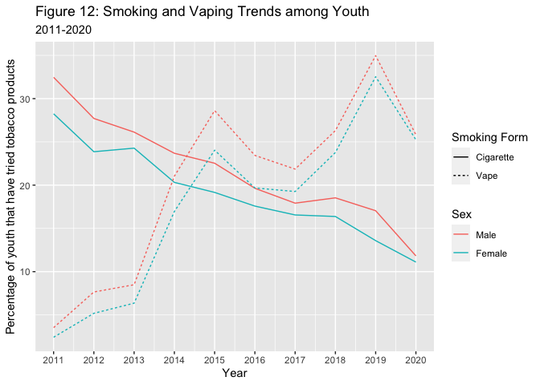

From Figure 12, it is clearly visible that smoking among youth are
decreasing over time, but that vaping is steadily increasing. Males are
also far more likely to both smoke and vape compared with females,
however there is very little variation within sexes, as both Males and
Females follow the same trajectories when it comes to smoking and
vaping. Of note is a decrease in vaping rates among youth in 2016, which
coincides with the US Food and Drug Administration (FDA) extending its
regulatory powers to e-cigarette products in August 2016, which banned
access of vapes to minors and required photo ID to purchase. A further
dip is observed between 2019 and 2020. Contextually there was a widely
reported outbreak of E-cigarette and Vaping Associated Lung Injury
(EVALI), in which according to the CDC as of February 2020 there were a
confirmed 2807 cases hospitalized and had been responsible for over 68
deaths. It is likely that the widely publicized stories on EVALI
contributed to the decrease in vape users from 2019 to 2020.

Exploring the consumption of vaping products by age furthermore reveals
interesting trends.

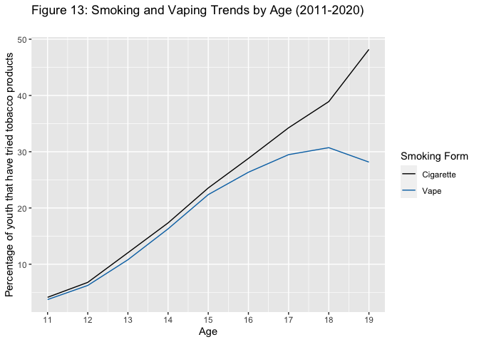

We can see from Figure 13 that as youth get older, they are much more
likely to either smoke or vape. The percentage of individuals vaping
decreases for older youth however, with a downward trend beyond 18. This
is likely due to individuals previously being able to purchase
cigarettes legally at 18 years of age. However, in 2019 the age to
purchase cigarettes was changed at a federal level from 18 to 21. There
will likely be a change in smoking and vaping trends among youth in
response to this law, and will likely narrow the gap between smoking and
vaping rates among older youth, as cigarette accessibility has been
reduced.

Frequent commentary on the youth consumption of e-cigarettes and vapes
critiques the supposed gateway drug status of vaping in leading youths
to smoking. Using the data from the National Youth Tobacco Survey’s we
will test this hypothesis and attempt to predict the smoking status of
individuals, based on their age, sex and whether or not they have vaped
before. Similar to the predictions above on the costs of smoking, we
will use both a parametric and non-parametric form, and compare their
predictive accuracy. Firstly, we will attempt to predict smoking status
via logistic regression. But before doing so, it is important to
determine whether this type of question should even be asked.

| Vaper? | Non-Smokers | Smokers | Total  | Percentage |
|:------:|:-----------:|:-------:|:------:|:----------:|
|   No   |   135469    |  20935  | 156404 |     13     |
|  Yes   |    16396    |  18910  | 35306  |     54     |

Smokers among Vapers and Non-Vapers

From the data in Table 2, we observe that smokers are far more prevalent
among vapers, comprising of 54% of vaping youth, compared with only 13%
of the non-vaping youth. It is therefore likely that we will be able to
determine an individuals smoking status based on, among other
predictors, their vaping status. As such, we will fit two different
models for our smoking status prediction and compare their
misclassification error to determine which model performs best.

It should also be noted that we have almost four times as many
non-smokers as opposed to smokers. As we have a large data set, we are
going to use undersampling, combining all smoking observations with an
equally sized sample of non-smokers for our training and testing data,
to ensure we have a class balance for our response. Furthermore, when
dividing into a training and test set, we will stratify on the response
to ensure a proportional amount of both smokers and non-smokers in our
training and testing data sets.

The first model we will fit is regressing smoking status based on age,
sex and vaping status.

    ## 
    ## Call:
    ## glm(formula = cigarette ~ age + sex + vape, family = binomial(link = "logit"), 
    ##     data = training_data)
    ## 
    ## Deviance Residuals: 
    ##      Min        1Q    Median        3Q       Max  
    ## -2.31736  -0.88704  -0.09698   0.97460   1.94829  
    ## 
    ## Coefficients:
    ##              Estimate Std. Error z value Pr(>|z|)    
    ## (Intercept) -5.025920   0.070717 -71.071  < 2e-16 ***
    ## age          0.306871   0.004635  66.205  < 2e-16 ***
    ## sexFemale   -0.085210   0.018031  -4.726 2.29e-06 ***
    ## vapeYes      1.809784   0.021861  82.787  < 2e-16 ***
    ## ---
    ## Signif. codes:  0 '***' 0.001 '**' 0.01 '*' 0.05 '.' 0.1 ' ' 1
    ## 
    ## (Dispersion parameter for binomial family taken to be 1)
    ## 
    ##     Null deviance: 88379  on 63751  degrees of freedom
    ## Residual deviance: 72655  on 63748  degrees of freedom
    ## AIC: 72663
    ## 
    ## Number of Fisher Scoring iterations: 4

If we fit our smaller model on the full training data set, the equation
for the fitted model is

 = -5.025920 + 0.306871 \times AGE -0.085210 \times FEMALE + 1.809784 \times VAPE")

.

In looking at model fit, we have a null deviance of 88379 on 63751
degrees of freedom, and a residual deviance of 72655 on 63748 degrees of
freedom.

For the hypothesis tests on
,
the p-value is less than

for each predictors and so we would conclude that there is sufficient
evidence to reject the null hypotheses that

at the 5% level of significance for each predictor.

The second model we will fit includes all the previous predictors as
well as all possible interactions between them.

    ## 
    ## Call:
    ## glm(formula = cigarette ~ age * sex * vape, family = binomial(link = "logit"), 
    ##     data = training_data)
    ## 
    ## Deviance Residuals: 
    ##     Min       1Q   Median       3Q      Max  
    ## -2.1921  -0.8774  -0.0512   0.9476   2.0024  
    ## 
    ## Coefficients:
    ##                        Estimate Std. Error z value Pr(>|z|)    
    ## (Intercept)           -5.391050   0.110047 -48.989  < 2e-16 ***
    ## age                    0.331060   0.007282  45.463  < 2e-16 ***
    ## sexFemale             -0.200357   0.157844  -1.269 0.204321    
    ## vapeYes                3.484988   0.247133  14.102  < 2e-16 ***
    ## age:sexFemale          0.008154   0.010454   0.780 0.435444    
    ## age:vapeYes           -0.109277   0.016054  -6.807 9.99e-12 ***
    ## sexFemale:vapeYes      1.165210   0.361486   3.223 0.001267 ** 
    ## age:sexFemale:vapeYes -0.079340   0.023516  -3.374 0.000741 ***
    ## ---
    ## Signif. codes:  0 '***' 0.001 '**' 0.01 '*' 0.05 '.' 0.1 ' ' 1
    ## 
    ## (Dispersion parameter for binomial family taken to be 1)
    ## 
    ##     Null deviance: 88379  on 63751  degrees of freedom
    ## Residual deviance: 72489  on 63744  degrees of freedom
    ## AIC: 72505
    ## 
    ## Number of Fisher Scoring iterations: 4

If we fit our larger model on the full training data set, the equation
for the fitted model is

 = -5.391050 + 0.331060\times AGE -0.200357\times FEMALE + 3.484988\times VAPE")

 -0.109277(AGE \times VAPE) + 1.165210(FEMALE \times VAPE) -0.079340(AGE \times FEMALE  \times VAPE)")

In looking at model fit, we have a null deviance of 88379 on 63751
degrees of freedom, and a residual deviance of 72489 on 63744 degrees of
freedom.

For the hypothesis tests on
,
the p-value is less than

for each predictors except sexFemale and age:sexFemale, so we would
conclude that there is sufficient evidence to reject the null hypotheses
that

at the 5% level of significance for each predictor except the
aforementioned.

We can perform a deviance test to compare the smaller and larger model,
to determine which is preferred. This tests whether the additional terms
of the interaction model are equal to 0.

    ## Analysis of Deviance Table
    ## 
    ## Model 1: cigarette ~ age + sex + vape
    ## Model 2: cigarette ~ age * sex * vape
    ##   Resid. Df Resid. Dev Df Deviance  Pr(>Chi)    
    ## 1     63748      72655                          
    ## 2     63744      72489  4   166.44 < 2.2e-16 ***
    ## ---
    ## Signif. codes:  0 '***' 0.001 '**' 0.01 '*' 0.05 '.' 0.1 ' ' 1

We receive a p-value of less than 2.2e-16 for our Deviance test. At the
5% significance level, we conclude that the additional interaction terms
are jointly significant and so we will retain the interaction model as
the preferred model.

We will now perform 5-fold cross validation on the training data to
assess the performance of our model. The classification threshold will
be 50%.

    ## [1] "Average Logistic Accuracy: 0.703403921568627"

    ## [1] "Average Logistic Sensitivity: 0.659129586446815"

    ## [1] "Average Logistic Specificity: 0.747629152280653"

The model has performed moderately well averaging an accuracy around of
70% in its prediction, and attained a moderate sensitivity of 66%, but a
stronger specificity of around 75%. This means that the logistic
regression model is moderately good at correctly identifying
non-smokers, but slightly worse at detecting smokers.

We will again compare the performance of the logistic regression tool
with a non-parametric tool in the form of classification trees.

If we perform the five-fold cross validation on for the classification
tree, we get the following result.

    ## [1] "Average Tree Accuracy: 0.693003921568627"

    ## [1] "Average Tree Sensitivity: 0.583918147335446"

    ## [1] "Average Tree Specificity: 0.802231484445755"

The tree has performed slightly worse with the accuracy, achieving an
accuracy of 69%. While the Specificity has improved to 80%, it has come
at the cost of Sensitivity, with the model only correctly identifying
smokers 58% of the time. The following tree was grown.

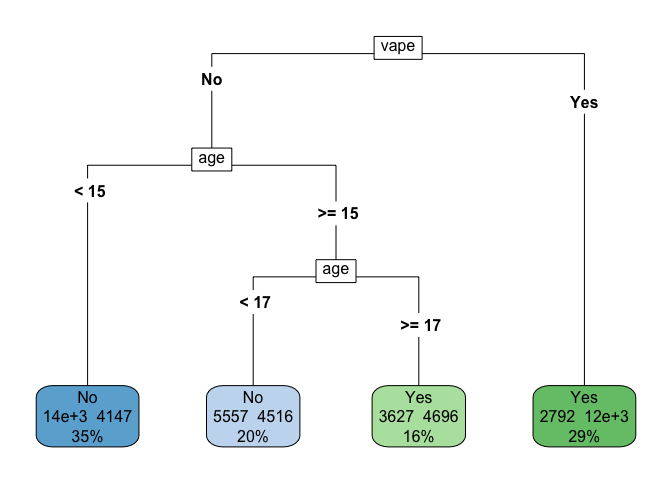<!-- -->

Given the large difference between the predictive ability of the model
for smokers and non-smokers, we will use the logistic interaction model
as the final model, as it generalises better to any unseen case. We
assess its test accuracy.

    ## Confusion Matrix and Statistics
    ## 
    ##           Reference
    ## Prediction   No  Yes
    ##        No  5904 2726
    ##        Yes 2065 5243
    ##                                           
    ##                Accuracy : 0.6994          
    ##                  95% CI : (0.6922, 0.7065)
    ##     No Information Rate : 0.5             
    ##     P-Value [Acc > NIR] : < 2.2e-16       
    ##                                           
    ##                   Kappa : 0.3988          
    ##                                           
    ##  Mcnemar's Test P-Value : < 2.2e-16       
    ##                                           
    ##             Sensitivity : 0.6579          
    ##             Specificity : 0.7409          
    ##          Pos Pred Value : 0.7174          
    ##          Neg Pred Value : 0.6841          
    ##              Prevalence : 0.5000          
    ##          Detection Rate : 0.3290          
    ##    Detection Prevalence : 0.4585          
    ##       Balanced Accuracy : 0.6994          
    ##                                           
    ##        'Positive' Class : Yes             
    ## 

Looking at the results of the confusion matrix, we can see that our
logistic model have produced nearly identical results to it’s
performance in the 5-fold validation, that is, an accuracy of 70%, a
sensitivity of 66% and a specificity of 74%. We can summarise this
performance using an ROC curve, displaying the AUC statistic.

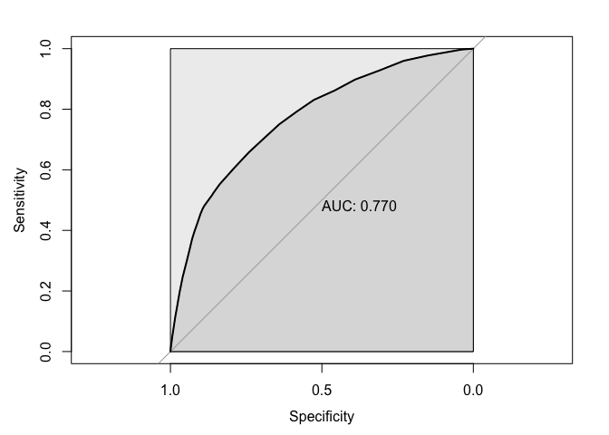<!-- -->

    ## 
    ## Call:
    ## roc.default(response = test_data$cigarette, predictor = logistic_probability,     direction = "<", plot = TRUE, auc.polygon = TRUE, print.auc = TRUE,     max.auc.polygon = TRUE, show.thres = TRUE)
    ## 
    ## Data: logistic_probability in 7969 controls (test_data$cigarette No) < 7969 cases (test_data$cigarette Yes).
    ## Area under the curve: 0.7704

As we can see, we have achieved moderate success with our logistic
model, in predicting the smoking status of youth through their age, sex
and vaping status.

## Discussion

Overall, there are interesting trends emerging both with regards to
smoking and vaping. In exploring our first question of where the United
States stood globally on smoking rates, we can see that they are far
from the highest smoking nation and currently contain roughly a third of
the smoking population percentage as the currently leading smokers.
Furthermore we observed that globally trends in smoking rates are
consistently decreasing.

When looking at the patterns in the United States throughout the late
1990s and 2000s, we can see this overall downward trend in smoking
rates. It is unsurprising to see this, given the wide scale public
education campaign that has occurred through the late 20th century in
educating people as to the harmful effects of smoking. Furthermore, as
more and more information emerged on the long-term impacts of smoking,
it became easier to directly identify certain illnesses as a direct
result of cigarette consumption. Smoking no longer is the ‘norm’ with
only roughly 20% of US adults smoking and no longer glorified on film
and television, given the heavy regulation that cigarettes have. So it’s
unsurprising that the number of non-smokers is increasing as new
generations shun the habit, and older generations unfortunately pass
away from smoking related illnesses.

Furthermore it is unsurprising that the US is now experiencing such high
economic burden from smoking related illnesses, given the delayed time
between the high point of smoking in the 1950s and the time needed for
individuals to develop smoking related illnesses. Given the direct
correlation between individuals getting sick and dying from smoking and
the cost to hospitalize and care for individuals suffering from this,
both the log-log and KNN models we’re very strong in predicting the
average cost for a state given the number of individuals dying from
smoking related illnesses. Such models would be very useful to US State
Governments so that they may allocate appropriate funding to healthcare
sectors which manage smoking related illnesses. Furthermore, as
prescription drugs are included in the costings, these models are also
valuable to pharmaceutical companies that can adjust their production of
medication to match the demand.

Finally, the large consumption of emerging smoking technologies
including vapes by youth is a concern as there have not been enough
longitudinal studies on the long term health effects on vaping. As
highlighted above, e-cigarettes were first introduced into the market in
2003, and so there is at most 20 years of data available on the
consumption of e-cigarettes and vaping products. Any data claiming that
vapes are ‘healthier’ than cigarettes cannot then account what long term
consequences may occur. In regards to detecting whether a youth has
tried cigarettes through, among several predictors, whether or not they
have vaped before, both the logistic model and the classification trees
had an average performance. Both models were better at detecting
non-smoker than non-smokers, despite the undersampling employed to
ensure an even amount of both in the test data. It may be because the
response variable, whether an individual has ever smoked or not, is too
general and does not account for the complexity of circumstances or
frequencies to which individuals will consume vapes or cigarettes.
Numerous other predictors related to smoking and its prevalence, such as
social circles, parental smoking status and socio-economic background
may yield better results that the models used. Alternatively, there may
just not be any link strong between vaping and smoking.

## Conclusion

The United States is a microcosm of larger global trends in shrinking
smoking rates. It is currently enduring its most challenging era of
smoking, as it deals with the consequences of long term mass cigarette
consumption, where the costs of such a challenge can be effectively
modeled and accurately predicted by either linear regression or KNN.
Fortunately the US is also seeing decreases in smoking populations among
every region, and new generations emerging that are taking up smoking.
Vaping among youth is on the rise and a situation that will be closely
observed as more and more data emerges on the long term effects of
vaping. While debate continues as to whether vaping has a causal
relationship with smoking, our logistic regression and classification
tree models, while decent at detecting non-smokers, only had moderate
success detecting smokers.

## Dataset Citations

.
Kaggle: World Health Organization; 2008-2018. Licence: CC BY-NC-SA 3.0
IGO. Data accessible at:
<https://www.kaggle.com/datasets/ozgurdogan646/who-tobacco-and-smoking-data-20082018?select=SmokingAndTobaccoData2008.csv>

,
Centers for Disease Control and Prevention (CDC). Behavioral Risk Factor
Surveillance System. Atlanta, Georgia: U.S. Department of Health and
Human Services, Centers for Disease Control and Prevention, 2015. Data
accessible at:
<https://data.cdc.gov/Smoking-Tobacco-Use/BRFSS-Prevalence-and-Trends-Data-Tobacco-Use-Four-/8zak-ewtm>

Smoking-Attributable Mortality, Morbidity, and Economic Costs (SAMMEC) -
Smoking-Attributable Expenditures (SAE), Centers for Disease Control and
Prevention (CDC). Atlanta, Georgia: U.S. Department of Health and Human
Services, Centers for Disease Control and Prevention, 2020. Data
accessible at:
<https://chronicdata.cdc.gov/Health-Consequences-and-Costs/Smoking-Attributable-Mortality-Morbidity-and-Econo/ezab-8sq5>

Smoking-Attributable Mortality, Morbidity, and Economic Costs (SAMMEC) -
Smoking-Attributable Mortality (SAM), Centers for Disease Control and
Prevention (CDC). Atlanta, Georgia: U.S. Department of Health and Human
Services, Centers for Disease Control and Prevention, 2020. Data
accessible at:
<https://chronicdata.cdc.gov/Health-Consequences-and-Costs/Smoking-Attributable-Mortality-Morbidity-and-Econo/4yyu-3s69>

}"),
Centers for Disease Control and Prevention (CDC). Office on Smoking and
Health, National Center for Chronic Disease Prevention and Health
Promotion. Atlanta, Georgia: U.S. Department of Health and Human
Services, Centers for Disease Control and Prevention, 2022. Data
accessible at:
<https://www.cdc.gov/tobacco/data_statistics/surveys/nyts/data/index.html>

,
United States Census Bureau, 2021. Data accessible at:
<https://www.census.gov/data/tables/time-series/demo/popest/intercensal-2000-2010-state.html>
